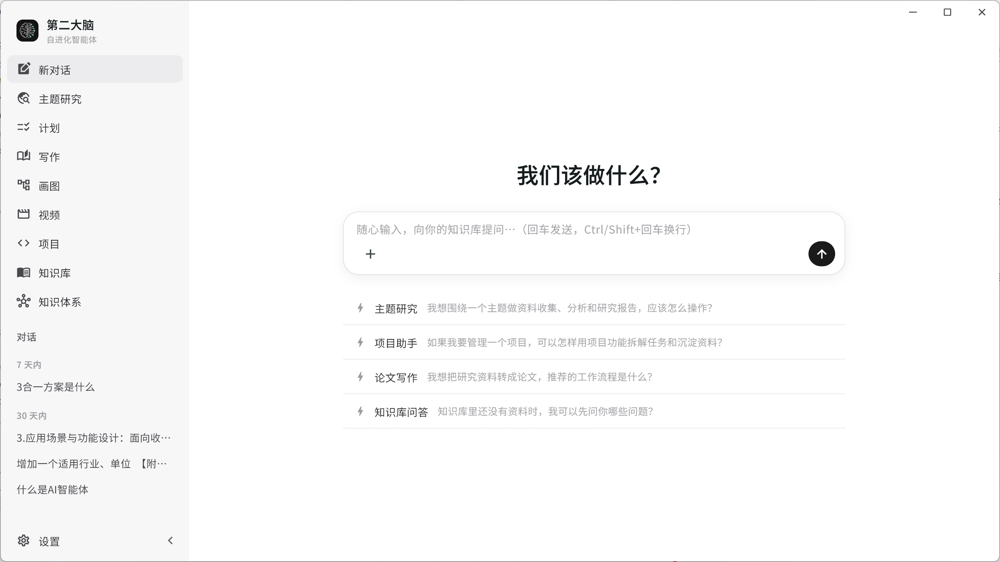
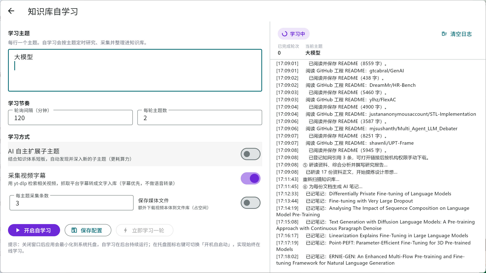

# Mind

[](https://flutter.dev/)
[](https://dart.dev/)
[](#支持平台)

Mind 是一个用 Flutter 构建的个人「第二大脑」应用。它把对话、研究、知识库、写作和项目开发放在同一个本地工作台里。

如果你只是想运行应用，不需要先理解整个代码库。安装 Flutter，配置本地 `.env`，拉取依赖，然后启动 Windows、Android 或 macOS 目标即可。

如果你想从源码构建、修改或打包 Mind，请继续阅读。

## 截图




## Mind 能做什么

Mind 面向需要长期收集资料、研究主题、写作创作，并把 AI 融入日常工作流的人。它把「收集资料 → 沉淀知识 → 深度研究 → 成果产出」的完整链路放进同一个本地工作台。

当前应用包含：

* **对话**：带持久化历史的对话会话，接入统一的 Agent 内核（工具调用 + 记忆）。
* **主题研究**：给定主题即自动多源检索（论文、代码、网页、本地参考、Zotero 等），汇总生成研究报告并归档进知识库。
* **计划**：每日待办管理，AI 可分析并调用统一 Agent 内核推进任务。
* **知识库（我的大脑）**：`2-标准笔记` + `3-文件库` 双层管理，支持引入文件夹入库、AI 自动分类归档、为文档自动建分类笔记、去重合并。
* **知识库自学习**：配置主题后按间隔自动跑「研究 → 媒体采集 → 整理」闭环，自动去重/合并分类/补关联/生成主题综述与知识体系概览；关闭窗口后最小化到系统托盘持续在后台学习，托盘菜单可一键开启开机自启，做到「始终在线自学习」。
* **媒体采集**：整合 yt-dlp + ffmpeg，URL 驱动地跨 1800+ 站点（YouTube/Bilibili/SoundCloud 等）多站点并行检索，并从研究命中的网页里补抽媒体链接，去重后按 URL 提取字幕转文字入库（字幕优先，可选下载媒体文件），自动走系统代理。
* **知识体系**：以知识图谱可视化笔记与主题之间的关联。
* **写作**：多形态创作套件，均接入统一大模型与写作记忆——
  * 文档、思维导图；
  * 专业书籍：资料自动匹配/下载/AI 解读、按章上传参考、成文时注入资料解读与写作记忆；
  * 小说：分层记忆（滚动摘要、章节回顾、设定库）保持长篇一致性；
  * 论文：SCI 结构化中英双语稿，可导出 PDF/LaTeX；
  * 推广：为指定应用生成知乎推文，可关联项目工程走读源码提炼真实特点后再成文。
* **画图**：基于成熟骨架模版（分层色带、微服务网关星型、数据管道、六边形端口适配器、C4 容器图、三层架构、时序图、业务流程图）用 AI 生成风格统一的专业架构图，支持无头浏览器高清 PNG 渲染、历史版本查看、图上文字直接双击编辑。
* **视频**：视频分镜脚本创作，从创意/主题出发生成梗概、logline 与逐镜头分镜脚本（景别、运镜、画面、动作、台词、音频、备注）。
* **项目 Agent**：在应用界面中查看、理解并修改软件工程（claude-code 式的 grep/glob/read 按需检索）。
* **自进化记忆**：分层记忆系统（技能沉淀/召回、会话归档、工作记事板），让 Agent 在使用中持续积累经验。
* **桌面集成**：Zotero、Playwright 辅助浏览与项目开发，系统托盘常驻与开机自启。

## 支持平台

Windows 是主要目标平台。它使用完整的桌面界面，并支持主题研究、计划、写作（文档/思维导图/专业书籍/小说/论文/推广）、画图、视频、项目开发、知识库（含自学习与 yt-dlp 媒体采集）与知识体系，以及 Zotero、Playwright、系统托盘常驻/开机自启和自定义窗口控制。

Android 使用移动端界面，包含对话、知识库、研究、知识体系、写作和设置等核心页面（项目开发、推广走读源码、知识库自学习/媒体采集等桌面能力不在移动端提供）。

macOS 可以按 Flutter 桌面应用方式运行。当前仓库没有提交 `macos/` 平台目录，首次在 Mac 上运行前需要先生成该目录。

仓库里的 `scripts/publish.ps1` 也包含 macOS 和 Linux 的发布逻辑，但当前提交的 Flutter 平台目录主要是 Windows 和 Android。

## 快速开始

先安装 Flutter，并确认目标平台可用：

```shell
flutter doctor
```

拉取依赖：

```shell
flutter pub get
```

在项目根目录创建本地 `.env`。这个文件只放在本机，不提交到仓库：

```text
DEEPSEEK_API_KEY=你的 DeepSeek API Key
DEEPSEEK_BASE_URL=https://api.deepseek.com
DEEPSEEK_MODEL=deepseek-v4-flash
```

运行 Windows 版本。推荐使用脚本，因为它会读取 `.env` 并把配置注入 Flutter：

```shell
powershell -ExecutionPolicy Bypass -File .\scripts\run.ps1
```

运行 Android 版本：

```shell
powershell -ExecutionPolicy Bypass -File .\scripts\run.ps1 -Device android
```

在 macOS 上首次运行前，先启用桌面支持并生成 macOS 平台目录：

```shell
flutter config --enable-macos-desktop
flutter create --platforms=macos .
```

然后从 `.env` 读取配置并启动 macOS 版本：

```shell
set -a
source .env
set +a
flutter run -d macos \
  --dart-define=DEEPSEEK_API_KEY="$DEEPSEEK_API_KEY" \
  --dart-define=DEEPSEEK_BASE_URL="${DEEPSEEK_BASE_URL:-https://api.deepseek.com}" \
  --dart-define=DEEPSEEK_MODEL="${DEEPSEEK_MODEL:-deepseek-v4-flash}"
```

## 从源码构建

构建 Windows Release。推荐使用发布脚本，因为它会读取 `.env`，并把 DeepSeek 配置通过 `--dart-define` 注入构建：

```shell
powershell -ExecutionPolicy Bypass -File .\scripts\publish.ps1 -Platform windows
```

发布脚本会把 Release 产物复制到 `dist/`，并在需要时补充 Windows 运行时 DLL。

如果你手动调用 Flutter 构建，需要自己传入 `--dart-define`：

```shell
flutter build windows --release --dart-define=DEEPSEEK_API_KEY=你的Key
```

创建 zip 发布包：

```shell
powershell -ExecutionPolicy Bypass -File .\scripts\publish.ps1 -Platform windows -Clean -Zip
```

使用 Inno Setup 构建 Windows 安装包：

```shell
powershell -ExecutionPolicy Bypass -File .\scripts\installer.ps1 -Clean -DesktopShortcut
```

在 macOS 上构建 Release：

```shell
set -a
source .env
set +a
flutter build macos --release \
  --dart-define=DEEPSEEK_API_KEY="$DEEPSEEK_API_KEY" \
  --dart-define=DEEPSEEK_BASE_URL="${DEEPSEEK_BASE_URL:-https://api.deepseek.com}" \
  --dart-define=DEEPSEEK_MODEL="${DEEPSEEK_MODEL:-deepseek-v4-flash}"
```

## 配置

Mind 会把用户数据保存在源码目录之外。Windows 上默认知识库路径是：

```text
D:\我的大脑
```

你可以在应用设置中修改知识库路径。

部分桌面功能依赖本机工具或服务：

* DeepSeek 默认配置来自本地 `.env`，通过 `scripts/run.ps1` 或 `scripts/publish.ps1` 注入应用。
* `.env` 已被 `.gitignore` 忽略，不要把真实 API Key 写进源码、README 或提交记录。
* Zotero 集成需要本机 Zotero 桌面端在配置端口上可访问。
* Playwright 辅助研究需要通过应用设置安装 Playwright 和 Chromium。
* 项目开发与推广走读源码采用 agentic 检索（grep/glob/read 按需定位），无需预建向量索引。
* 画图的高清 PNG 渲染依赖本机 Edge/Chrome（无头模式），媒体采集内置 yt-dlp/ffmpeg（随应用捆绑）。
* 知识库自学习/媒体采集会自动读取 Windows 系统代理，若目标站点需要代理请先在系统开启。
* AI 功能使用 OpenAI 兼容的 Chat Completions API，可在设置中为不同任务角色配置模型与供应商。

## 仓库结构

```text
lib/main.dart                 应用入口和服务装配
lib/ui/                       桌面端和移动端页面
lib/services/                 应用服务、研究源、存储和外部集成
lib/services/agent/           Agent 循环、工具、记忆和模型客户端
assets/icon/                  应用图标资源
android/                      Android 平台工程
windows/                      Windows 平台工程
scripts/publish.ps1           发布打包脚本
scripts/installer.ps1         Windows 安装包脚本
scripts/run.ps1               本地运行脚本，负责读取 .env
tool/make_ico.dart            图标生成辅助工具
```

## 开发说明

生成文件和本地构建产物会被忽略。需要时可以通过 `flutter pub get`、`flutter build` 或上面的脚本重新生成。

应用仍在快速演进。改动应尽量小，提交前运行 `flutter analyze`，并优先使用符合现有服务和页面结构的简单 Flutter/Dart 代码。

## 其他

如果你喜欢我的项目，可以给我买杯咖啡：

